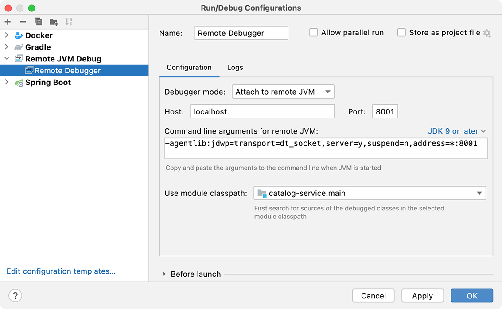

### AWS Startup Template For Spring Boot Developers
#### Welcome to AWS Full-Stack Developer Template: Swagger UI + Spring Boot + Terraform + Kubernetes + Keycloak Oauth2 Authorization Server + Github Actions + Local Docker Build and Start Environment + Integration Tests with TestContainers + Spring Cloud Gateway + Spring Cloud Stream + Dispatcher Pattern + AWS SSL Certificate + External DNS + AWS Load Balancer Controller + Spring Cloud Kubernetes + Grafana Observability Stack

#### Local Docker Environment Setup:

```
sh docker-start.sh
```

- this script will build docker images and start environment with your code changes

- Warning! Make sure that all kafka containers are successful are started successfully! (see `Kafka Containers Troublesshooting` below)

- open `localhost:9000` in your Browser and switch between `Order` and `Customer` Microservices

- Warning! If Swagger UI fails to load on the first try, please, refresh the page!

- Warning! Sometimes switching between `Order` and `Customer` doesn't refresh Swagger UI completely and you might see wrong REST endpoints: just refresh the page and continue

- click "Authorize" and use admin/admin or user/user for credentials (clientId should be `order-app`)

- create Customer on `Customer` page (see `json-files/customer.json` as example)

- create Order on `Order` page (see `json-files/order.json` as example: restaurants with these ids are already created with sql init scripts)

- Warning! If Kafka or Schema Registry has errors, you will see error "Customer with this id doesn't exist", because customer, created in the previous step, was not propagated by Kafka. Please, make sure that your Kafka Containers are running correctly (see  `Kafka Containers Troublesshooting`)

- if order is created successfully you will receive 200 response with `tracking_id`

- find the order by `tracking_id` copied from the previous response. 

- If you see the order and it has status `PAID`, then Kafka is configured correctly.

- Congratulations! You successfuly tested `Food Ordering System` Saga transactions and CQRS!

- See this README file for AWS Infrastructure Setup: **https://github.com/greeta-restaurant-01/order-infra**


### Remote Debugging



- if you want to debug your AWS kubernetes services remotely, use port forwarding:

```
kubectl port-forward 8002:8002
```


#### Kafka Containers Troubleshooting

- Check containers in the following order:
- `Kafka Server (cp-server)`: if container has errors or stopped responding (check the logs), remove container (docker stop, docker rm ) and run `docker-compose up -d` again
- `Init Kafka (cp-kafka)`: container should finish creation of kafka topics successfully and then stop. If container is not responding or has errors, remove container (docker stop, docker rm ) and run `docker-compose up -d` again
- `Schema Registry (cp-schema-registry)`: if container has errors or stopped responding (check the logs), remove container (docker stop, docker rm ) and run `docker-compose up -d` again
- If everything is cussessful, containers `cp-server` and `cp-schema-registry` should be running without errors and container `cp-kafka` should finish its job and exit without errors.
